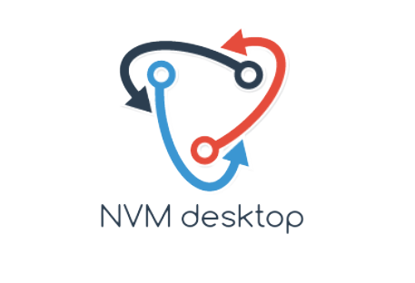

<br/>
<p align="center">
  <a href="https://github.com/julienawon/nvm-desktop">
    
  </a>

  <h3 align="center">This is a desktop application for managing Node.js versions using Node Version Manager (NVM) built with PyQt6.</h3>

  <p align="center">
    Unlocking the power of possibilities.
    <br/>
    <br/>
    <a href="https://github.com/julienawon/nvm-desktop"><strong>Explore the docs »</strong></a>
    <br/>
    <br/>
    <a href="https://github.com/julienawon/nvm-desktop">View Demo</a>
    .
    <a href="https://github.com/julienawon/nvm-desktop/issues">Report Bug</a>
    .
    <a href="https://github.com/julienawon/nvm-desktop/issues">Request Feature</a>
  </p>
</p>

      

## Table Of Contents

* [About the Project](#about-the-project)
* [Built With](#built-with)
* [Getting Started](#getting-started)
  * [Prerequisites](#prerequisites)
  * [Installation](#installation)
* [Usage](#usage)
* [Contributing](#contributing)
* [License](#license)
* [Authors](#authors)
* [Acknowledgements](#acknowledgements)

## About The Project


The NVM (Node Version Manager) desktop app with PyQt6 is a software application that enables users to manage multiple versions of Node.js on their computer. The app will allow users to easily switch between different versions of Node.js, install and uninstall different versions, and manage their Node.js packages.

The NVM desktop app will also include features such as automatic updates, error handling, and notifications for new Node.js versions and package updates.

Overall, the NVM desktop app with PyQt6 will provide an easy and intuitive way for developers to manage their Node.js installations and packages, improving their productivity and making their development workflows more efficient.

## Built With

- Python: Programming language used to develop the app
- PyQt6: Python bindings for the Qt cross-platform GUI framework used to build the user interface
- Node Version Manager (NVM): Utility used to manage multiple versions of Node.js on the user's system
- Node Package Manager (NPM): Default package manager for Node.js used to manage packages within the app
- PyUpdater: Library used to handle automatic updates for the app
- PyInstaller: Tool used to package the app for distribution on different operating systems

The NVM desktop app with PyQt6 is built using a combination of Python and PyQt6, which provides a cross-platform GUI toolkit for creating desktop applications. The app utilizes Node Version Manager (NVM) to manage multiple versions of Node.js on the user's system, and Node Package Manager (NPM) to manage packages within the app. PyUpdater is used to handle automatic updates for the app, while PyInstaller is used to package the app for distribution on different operating systems.


## Getting Started

To get started with the NVM desktop app with PyQt6, follow these steps:

### Prerequisites

- Python 3.x: You can download the latest version of Python from the official website.

- Node.js and NVM: You can download Node.js and NVM from the official website.

- PyQt6: You can install PyQt6 using pip by running the following 
    command:
     ```sh
     pip install PyQt6
     ```

### Installation

1. Clone the repository:
```sh
git clone https://github.com/julienawon/nvm-desktop.git
```

2. Navigate to the project directory:

```sh
cd nvm-desktop-app
```

3. Install the required dependencies:

```sh
pip install -r requirements.txt
```


## Usage

To run the app, simply run the following command in the project directory:

```sh
python main.py
```

### Building the App
To build the app for distribution, you can use PyInstaller. Run the following command to create a standalone executable for the app:

```sh
pyinstaller --onefile --windowed main.py
```

## Contributing
Please see CONTRIBUTING.md


### Creating A Pull Request

1. Fork the Project
2. Create your Feature Branch (`git checkout -b feature/AmazingFeature`)
3. Commit your Changes (`git commit -m 'Add some AmazingFeature'`)
4. Push to the Branch (`git push origin feature/AmazingFeature`)
5. Open a Pull Request

## License

Distributed under the MIT License. See [LICENSE](https://github.com/julienawon/nvm-desktop/blob/main/LICENSE.md) for more information.

## Authors

* **Julien AWON'GA** - *CS Student* - [Julien AWON'GA](https://github.com/julienawon)

## Acknowledgements
